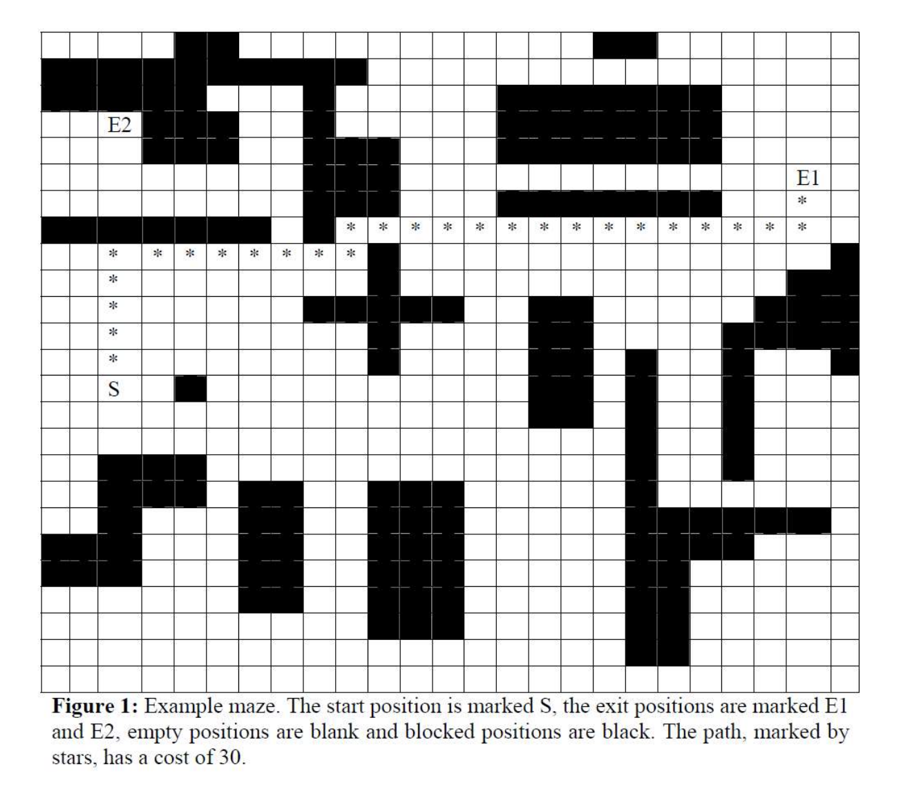

# Common Search Strategies

This is a collection of common and easy-to-implement search strategies. There are two main classes _Uninformed Search_ and _Informed Search_ strategies.

All search strategies are classified with 4 factors:
1. __Completeness__: can the algorithm find a solution if one exists?
2. __Optimality__: can the algorithm find the most optimal solution if one exists?
3. __Time Complexity__: what is the runtime upper bound of the algorithm?
4. __Space Complexity__: what is the memory upper bound of the algorithm?

## Uninformed Searches

This is the class of searches where there is no information about the environment. As no search heuristics are given, the performance of this class of searches tends to perform more poorly compared to informed searches.

### Breadth First Search

Expand the shallowest unexpanded nodes, storing the fringe to be expanded in a FIFO queue.
   _High memory requirement_

* _Completeness_: Yes if the branching factor _b_ is finite.
* _Optimality_: Yes if the _cost = depth_.
* _Time Complexity_: _O(bd+1)_
* _Space Complexity_: _O(bd+1)_

   _where b is the branching factor and d is the depth_

### Depth First Search

Expand the deepest unexpanded nodes, storing the fringe to be expanded in a LIFO stack.

* _Completeness_: Yes if search space has no loops.
* _Optimality_: No.
* _Time Complexity_: _O(bm)_
* _Space Complexity_: _O(bm)_

   _where b is the branching factor and m is the maximum length of any path_

### Uniform Cost Search

Expand the lowest cost unexpanded node, storing the fringe to be expanded in a minimum priority queue.
   _Cannot have zero or negative costs_

* _Completeness_: Yes if the branching factor _b_ is finite.
* _Optimality_: Yes.
* _Time Complexity_: _O(bd)_
* _Space Complexity_: _O(bd)_

   _where b is the branching factor and d is the depth_

### Depth Limited Search

Execute DFS with a maximum search depth as a restriction.
   _This prevents loops and infinite depth problems_

* _Completeness_: Yes if the the solution is within the limited depth.
* _Optimality_: No
* _Time Complexity_: O(bl)
* _Space Complexity_: O(bl)

   _where b is the branching factor and l is the limit on the depth_

### Iterative Deepening Search

Iteratively, execute DLS with an increasing maximum search depth _l_ until a solution is found.
   _Acts like BFS but requires a lot less memory_

* _Completeness_: Yes if the branching factor _b_ is finite.
* _Optimality_: Yes if the _cost = depth_.
* _Time Complexity_: _O(bd)_
* _Space Complexity_: _O(bd)_

   _where b is the branching factor and d is the depth_

## Informed Seaches

This is the class of searches where there is heuristic information about the environment. The give heuristic function `h(n)` is information that can be used to direct the search towards the goal. Having a better heuristic function will allow the search to find the goal faster.

There are 3 kinds of heuristics:
1. Perfect Heuristic: _h(n) = h*(n)_
   * In this case, the heuristic function is a perfect estimate of where the goal is.
2. Null Heuristic: _h(n) = 0_
   * In this case, there is no extra information that the heuristic function could provide.
3. Better Heuristic: _h1(n) < h2(n) < h*(n)_ 
   * In this case, _h2(n)_ is a better heuristic than _h1(n)_.

These heuristic functions are utilized in the following informed searches in some way. Each informed search uses a objective function _f(n)_ to decide which node to expand next in its path.

### Best First Search/Greedy Algorithm

Purely follows the heuristic function to determine which node to expand next.

__Objective Function__: _f(n) = h(n)_

* _Completeness_: No, can get stuck in loops.
* _Optimality_: No.

### A* Search

Follows both the cost to get from the starting node to the current node _g(n)_ and the heuristic function.

__Objective Function__: _f(n) = g(n) + h(n)_

* _Completeness_: Yes if the branching factor _b_ is finite.
* _Optimality_: Yes.

### Beam Search

Expands the best _B_ nodes at each level.

__Objective Function__: _f(n) = h(n)_

* _Completeness_: No.
* _Optimality_: No.

### Hill Climbing Search

Expands the best node at each level.

__Objective Function__: _f(n) = h(n)_

* _Completeness_: No.
* _Optimality_: No.

## Sample Maze

The following is a sample environment maze that is used to run the search algorithms on.

The heuristic function chosen for informed searches is simply the Manhattan distance from the current node to the goal node.