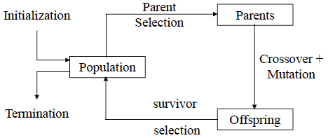
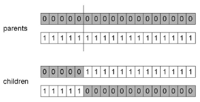
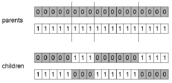
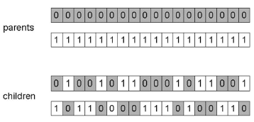
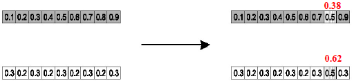

# Genetic Algorithm

A class of evolutionary algorithms that operate by maintaining a population of candidate solutions and iteratively applying a set of stochastic operators, namely selection, reproduction, and mutation. Inspired by Darwin's theory of natural selection, the population eventually moves towards fitter solutions.



## Algorithm
```
Initialize starting population of solutions
Repeat
   Calculate Fitness of the population
   Select parents with bias to their fitness values, higher fitness means higher probability of being chosen as a parent.
   Create children from the selected parents using crossover (promotes exploration).
   Mutate the children by changing specific chromosomes (promotes exploitation).
   Do Survivor selection to determine which parents and which children are going to be in the next generation.
End when preset number of generations is reached.
Return optimal solution from the generations.
```

## Crossover

Crossover is performed between two parents in order to bring exploration into the solutions.
There can be multiple kinds of problems that GA is used for and the crossover process depends on the problem.

### Crossover for Binary Solutions
1. _1_-Point Crossover

A random point is chosen on the two parents, and the two children are formed by exchanging the tails this point partitions.

2. _N_-Point Crossover

A generalization of 1-point crossovers where _N_ points are chosen on the two parents, and the two children are formed by combining alternating partitions between points.

3. Uniform Crossover

Each gene has an independent 0.5 chance of undergoing recombination, which makes inheritance independent of position.
This prevents transmitting co-adapted genes.

### Crossover for Real-Valued Solutions
1. Single Arithmetic Crossover

For a single parent gene pair _x_ and _y_, one child's gene becomes 𝛼𝑥+(1−𝛼)𝑦, and the reverse for the other child.